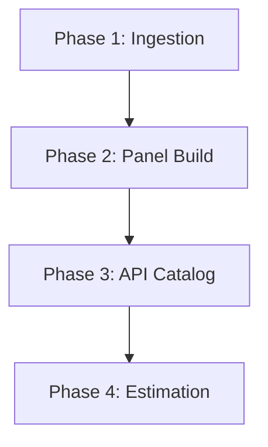

# End-to-End Automated Causal Panel Extraction Architecture

A modular, reproducible pipeline for ingesting remote tabular archives, constructing panel datasets with baseline-adjusted metrics, extracting structured catalogs from HTTP APIs, and estimating staggered event-study models. This repository ships **template code only**—no raw data, proprietary schemas, or domain-specific identifiers.

---

## Repository Layout

```
causal-panel-pipeline/
├── .env.example          # Environment variable template
├── .gitignore            # Excludes data artifacts and secrets
├── requirements.txt      # Python dependencies
├── data_downloader.py    # Phase 1: ingestion and decompression
├── panel_builder.py      # Phase 2: panel construction
├── estimation_model.R    # Phase 4: econometric estimation
└── README.md
```

Recommended runtime directories (created automatically, git-ignored):

```
data/
├── raw/                  # Downloaded archives
└── processed/            # Master and panel tables
output/                   # Estimation artifacts
logs/                     # Optional execution logs
```

---

## Prerequisites

| Component | Version | Purpose |
|-----------|---------|---------|
| Python | 3.10+ | Ingestion and panel scripts |
| R | 4.2+ | Event-study estimation |
| `fixest` | latest | Sun–Abraham staggered DiD |

### Python setup

```bash
python -m venv venv
source venv/bin/activate   # Windows: venv\Scripts\activate
pip install -r requirements.txt
cp .env.example .env       # populate credentials locally
```

### R setup

```r
install.packages("fixest")
```

---

## Architecture Overview

The pipeline is organized into four sequential phases. Each phase is idempotent, logs progress to stdout, and writes artifacts to predictable paths so downstream steps can be orchestrated by Make, Airflow, or shell scripts.



---

## Phase 1 — Ingestion & Decompression

**Module:** `data_downloader.py`

### Responsibilities

- Authenticate against a remote API using credentials from `.env`
- Stream-download zipped archive batches with bounded timeouts
- Decompress archive members and normalize heterogeneous payloads (CSV, JSON) into a unified schema
- Deduplicate records by entity identifier, retaining the latest batch provenance
- Throttle outbound requests to respect upstream rate limits

### Usage

```bash
python data_downloader.py \
  --url "https://example.com/api/v1/archives/sample_batch.zip" \
  --output data/processed/master_table.csv \
  --throttle 2.0
```

### Outputs

| Artifact | Description |
|----------|-------------|
| `data/raw/latest_archive.zip` | Cached remote archive |
| `data/processed/master_table.csv` | Consolidated entity-level table |

### Operational notes

- Use `--skip-download --local-archive path/to/file.zip` to reprocess without network I/O
- Failed HTTP attempts are logged and surfaced as non-zero exit codes for CI integration

---

## Phase 2 — Panel Construction & Baseline Validation

**Module:** `panel_builder.py`

### Responsibilities

- Load the consolidated master table
- Compute group-period baseline statistics (median by default)
- Derive a deviation metric: `metric_deviation = metric_value − group_baseline`
- Emit summary statistics (row counts, unit cardinality, deviation moments) for QA gates
- Support chunked processing for memory-constrained environments

### Usage

```bash
python panel_builder.py \
  --input data/processed/master_table.csv \
  --output data/processed/panel_table.csv \
  --entity-col entity_id \
  --group-col group_id \
  --time-col period_id \
  --value-col metric_value
```

For large inputs:

```bash
python panel_builder.py --chunked
```

### Validation checklist

- [ ] Deviation distribution is centered near zero within group-period cells
- [ ] Unit and time coverage match design documentation
- [ ] No unexpected duplicate entity-time keys

---

## Phase 3 — API Catalog Extraction

Phase 3 is intentionally **schema-agnostic** in this template. In a production deployment, implement a dedicated catalog extractor that:

1. Queries a paginated REST endpoint (`API_BASE_URL`) with token authentication (`API_TOKEN`)
2. Applies temporal slicing or cursor pagination to bypass per-request row caps
3. Normalizes nested JSON into a flat catalog table
4. Persists the catalog outside version control (see `.gitignore`)

### Recommended patterns

| Concern | Pattern |
|---------|---------|
| Pagination caps | Temporal windows or keyset pagination |
| Retries | Exponential backoff with jitter |
| Deduplication | Primary key on stable document identifier |
| Provenance | `fetched_at` timestamp column on every row |

Extend `data_downloader.py` or add `catalog_extractor.py` following the same logging, throttling, and exit-code conventions established in Phase 1.

---

## Phase 4 — Econometric Estimation

**Module:** `estimation_model.R`

### Responsibilities

- Load the panel produced in Phase 2
- Estimate a staggered event-study specification via `fixest::sunab()`
- Absorb unit and time fixed effects
- Cluster standard errors at the cohort level
- Export coefficient tables and serialized model objects

### Model template

```r
outcome ~ sunab(cohort_id, event_time, ref.p = -1) | entity_id + period_id
```

### Usage

```bash
Rscript estimation_model.R
```

### Outputs

| Artifact | Description |
|----------|-------------|
| `output/event_study_coefficients.csv` | Coefficient table with standard errors |
| `output/event_study_model.rds` | Serialized `fixest` model object |

### Inference notes

- Adjust `REF_PERIOD` to match your pre-trend window
- Replace `CLUSTER_VAR` when cohort cardinality differs from the clustering dimension required by your design
- For low cluster counts, consider conservative degrees-of-freedom adjustments via `ssc()` in `fixest`

---

## Environment Configuration

Copy `.env.example` to `.env` and populate:

| Variable | Description |
|----------|-------------|
| `API_BASE_URL` | Root URL for catalog and archive endpoints |
| `API_TOKEN` | Bearer token or API key |
| `DB_CONNECTION_STRING` | Optional warehouse connection for large-scale storage |

Never commit `.env` to version control.

---

## Orchestration Example

```bash
#!/usr/bin/env bash
set -euo pipefail

python data_downloader.py
python panel_builder.py --chunked
Rscript estimation_model.R
```

Integrate this script into your CI/CD runner with secret injection for `API_TOKEN`.

---

## Data Policy

This repository **does not** distribute raw or processed datasets. All tabular extensions (`*.csv`, `*.zip`, `*.gz`) are excluded via `.gitignore`. Consumers must supply their own licensed inputs and keep artifacts local or in private object storage.

---

## Extensibility

| Extension point | Suggested approach |
|-----------------|-------------------|
| New file formats | Add a parser branch in `parse_member_payload()` |
| Alternative baselines | Swap median for mean or quantile in `compute_group_baselines()` |
| Subsample estimation | Parameterize `estimation_model.R` with CLI args via `optparse` |
| Workflow scheduling | Wrap phases in Makefile targets or a DAG runner |

---

## License

MIT — see [LICENSE](LICENSE).
